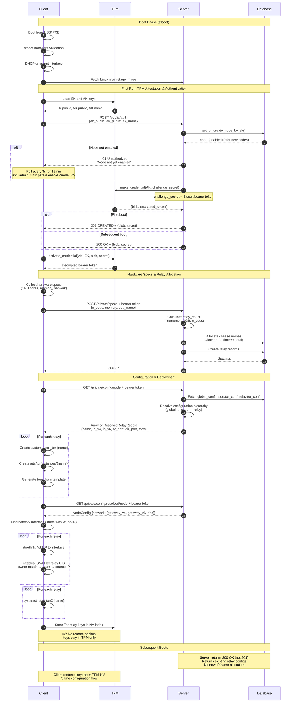

# Patela

Both client and server for disk-less tor configuration. Is a pull-based
configuration manager that relies on tpm for identity and crypto operation.

**Patela** is the [piedmont](https://en.wikipedia.org/wiki/Piedmont) word for kick.

## Main components

- [actix-web](https://actix.rs): web server
- [rustls](https://github.com/rustls/rustls): (m)Tls embedded replacement for openssl
- [tss-esapi](https://github.com/parallaxsecond/rust-tss-esapi): tpm2 bindings
- [biscuit](https://www.biscuitsec.org/): session token
- [sqlx](https://github.com/launchbadge/sqlx): simple sql library

## Main flow

### Boot

We rely on [stboot](https://git.glasklar.is/system-transparency/core/stboot), a
beautiful bootloader by [System
Transparency](https://docs.system-transparency.org/st-1.0.0/).

1. live boot from usb (future with iPxe)
2. stboot hw validation
3. dhcp mgmt interface
4. fetch linux main stage image from server

### First run (V2 - TPM Attestation)

1. `client`: load TPM Endorsement Key (EK) and Attestation Key (AK)
2. `client`: send authentication request with EK public, AK public, and AK name
3. `server`: create or retrieve node by matching TPM keys (EK + AK + AK name)
4. `server`: check if node is manually enabled by administrator
5. `server`: create TPM attestation challenge using make_credential
6. `server`: encrypt Biscuit session token with TPM challenge
7. `client`: activate credential using TPM to decrypt the challenge
8. `client`: extract bearer token from decrypted challenge response
9. `client`: report hardware resources (CPU cores, memory, etc.)
10. `server`: calculate relay count based on specs (min of cores, memory/1GB)
11. `server`: allocate IPs and cheese names for relays
12. `server`: build configuration hierarchy (global → node → relay)
13. `database`: store relay information with allocated resources
14. `client`: fetch relay configurations with resolved Tor settings
15. `client`: create Tor relay instances (users and directories)
16. `client`: apply network configuration (IP binding via rtnetlink)
17. `client`: configure UID-based source routing (nftables SNAT)
18. `client`: generate torrc files from templates with relay-specific settings
19. `client`: start Tor relay systemd services
20. `client`: store Tor keys in TPM NV index (no remote backup in V2)

### Subsequent runs

The flow is identical to first run, except:

1. `server`: recognizes existing node from TPM keys (returns 200 OK instead of 201 CREATED)
2. `server`: returns existing relay configurations instead of allocating new ones
3. `client`: restores Tor keys from TPM NV storage (not from remote backup)

### Architecture Diagram



## Future work and design

### Remote attestation

V2 implements TPM-based remote attestation using the `make_credential` / `activate_credential` challenge-response protocol:

**How it works**:
1. Client loads EK (Endorsement Key) and AK (Attestation Key) from TPM
2. Client sends public keys to server
3. Server creates a challenge encrypted to the specific TPM using `make_credential`
4. Only the TPM with the matching EK can decrypt via `activate_credential`
5. This proves the client possesses the specific TPM hardware

**Security properties**:
- Node identity is bound to TPM hardware (EK + AK + AK Name)
- Cannot be cloned without physical TPM access
- No shared secrets or certificates to steal
- Manual administrator approval required for new nodes (`enabled` flag)

**Comparison to V1**: V1 used hardcoded client certificates which could be stolen. V2's TPM attestation provides hardware-bound identity that cannot be extracted from the client binary.

## Getting started

To get tpm and sqlite working is good to configure a couple of variables

```console
export DATABASE_URL="sqlite:$PWD/patela.db"
```

```console
cargo sqlx database setup --source server/migrations
cargo run -p client
```

Test server

```console
cargo run -p server
```

For development this can be useful for logging and reload

```console
watchexec -w server -r cargo run -p patela-server -- run -vv
```

TPM emulation for dev, install [swtpm](https://github.com/stefanberger/swtpm)

To access the tpm device without root permission you should add this udev rule
in `/etc/udev/rules.d/` as show in [reference
docs](https://github.com/tpm2-software/tpm2-tss/blob/master/dist/tpm-udev.rules).

```console
# tpm devices can only be accessed by the tss user but the tss
# group members can access tpmrm devices
KERNEL=="tpm[0-9]*", TAG+="systemd", MODE="0660", OWNER="wheel"
KERNEL=="tpmrm[0-9]*", TAG+="systemd", MODE="0660", GROUP="wheel"
KERNEL=="tcm[0-9]*", TAG+="systemd", MODE="0660", OWNER="wheel"
KERNEL=="tcmrm[0-9]*", TAG+="systemd", MODE="0660", GROUP="wheel"
```

And reload the rules

```console
udevadm control --reload-rules && udevadm trigger
```

```console
export XDG_CONFIG_HOME=~/.config
```

first setup

```console
/usr/share/swtpm/swtpm-create-user-config-files
mkdir -p ${XDG_CONFIG_HOME}/patelatpm
swtpm_setup --tpm2 --tpmstate ${XDG_CONFIG_HOME}/patelatpm \
   --create-ek-cert --create-platform-cert --lock-nvram
```

now run the tpm emulator

```console
swtpm socket --tpm2 \
 --server type=tcp,port=2321 \
 --ctrl type=tcp,port=2322 \
 --tpmstate dir=${XDG_CONFIG_HOME}/patelatpm \
 --log file="swtpm.log" \
 --log level=20 \
 --flags not-need-init,startup-clear
```

```console
export TPM2TOOLS_TCTI="swtpm:host=localhost,port=2321"
```

## Notes

Here are free words, both for documentation and for future blog post

### Authentication (V2)

V2 uses TPM-based attestation instead of mTLS certificates for node identity:

**Node Identity**: Combination of three TPM values:
- Endorsement Key (EK) public part
- Attestation Key (AK) public part
- AK Name (cryptographic name of the AK)

**Authentication Flow**:
1. Client loads EK and AK from TPM
2. Client sends public keys to server (`POST /public/auth`)
3. Server matches node by `(ek_public, ak_public, ak_name)` triple
4. Server creates attestation challenge using `make_credential`
5. Server encrypts Biscuit bearer token as challenge secret
6. Client uses `activate_credential` to decrypt (only possible with the correct TPM)
7. Decrypted token becomes the session bearer token

**TLS**: Server still uses TLS (server-side certificate only), but client authentication happens via TPM attestation, not client certificates.

**Manual Approval**: New nodes are created with `enabled=0` and require admin approval via `patela enable <node_id>` before they can authenticate.

## TODO

```
mkcert -install localhost 127.0.0.1 ::1
```

```
mkcert -CAROOT localhost 127.0.0.1 ::1
```

```
biscuit keypair
```

## TPM

Is not trivial to deal with the tpm2 interface, fortunatly the example of the
rust bindings are really well documented, all the patela's code is just a
rework of two example:

1.  [certify](https://github.com/parallaxsecond/rust-tss-esapi/blob/main/tss-esapi/examples/certify.rs)
    for attestation and enrollment with the server
2.  [symmetric file encrypt
    decrypt](https://github.com/parallaxsecond/rust-tss-esapi/blob/main/tss-esapi/examples/symmetric_file_encrypt_decrypt.rs)
    to encrypt the relay's keys for remote backup

## QEMU, Debian and Deploy

For running a qemu/kvm you need some configurations:

- TPM virtualization/passtrought: if you got a permission error on tpm creation
  look the permissions in the `/var/lib/swtpm-localca/`. They should match the
  `swtpm_{user, group}` parameter in `/etc/libvirt/qemu.conf`
- Create a main network a dhcp server exposed: your server should be reachable
  on this network.
- Create a second "isolated" network that will be used for test
- Mount the working directory with `virtiofs` and than `mount -t /{your mount
name} /mnt`

We deploy on a pre-build debian image, but we don't make any assumption, you
just need some deps:

- `systemd`: handling with relay lifecicle
- `dhcp`: a client for the first connection
- `libtss2-dev`: tpm library

If you need to compile for old libc version or other exotic triplet you shuld
checkout [cargo zigbuild](https://github.com/rust-cross/cargo-zigbuild), is
just amazing. In my use case I want to build the debug version on my archlinux
laptop and run in a debian bookworm vm. The two glibc are incompatible but with
zig you need just to run:

```console
cargo zigbuild --target x86_64-unknown-linux-gnu.2.36
```

To test with qemu/libvirt you can start with a virsh example in
`misc/virsh.xml`, open the file and replace `YOUR_PATH` with a valid
debian/linux kernel image and cpio, there is also a shared filesystem to mount
the code directory inside the guest for dev. This setup assume also a couple of
network interface, one for nat and the other for ip bindings.

Some useful command:

Attach to the console

```console
virsh -c qemu:///system console patela
```

Mount the host filesystem

```console
mount -t virtiofs /patela /mnt
```

Clear tpm from persistent setup

```console
/mnt/target/x86_64-unknown-linux-gnu/debug/patela-client --tpm2 /dev/tpmrm0 tpm clean-persistent
```

Run patela with the server on the host

```console
/mnt/target/x86_64-unknown-linux-gnu/debug/patela-client --server https://192.168.122.1:8020 --tpm2 /dev/tpmrm0
```

If you need to remove all ip address from interface for dev

```console
ip addr flush <DEV>
```
